# HWB2
### author: 2020283104 王鸿斌
## 测试用图  
尺寸：1290*720
 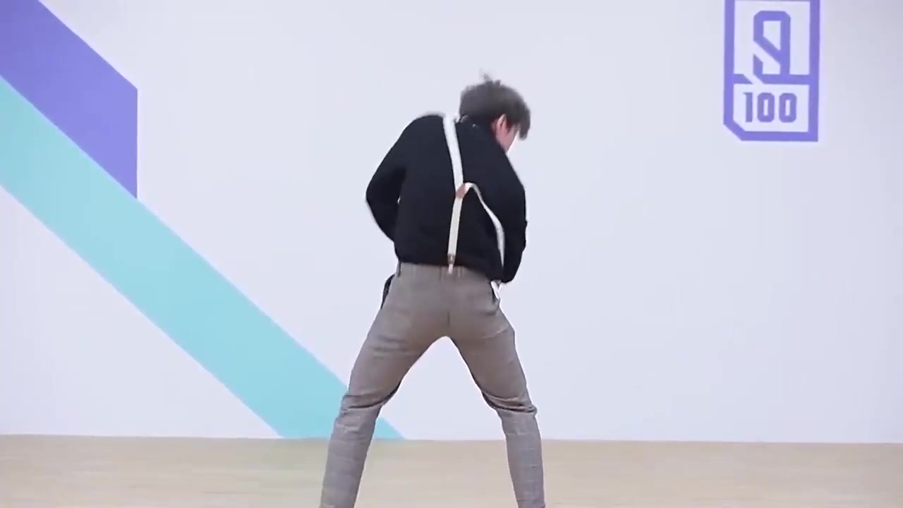

### 灰度直方图  
 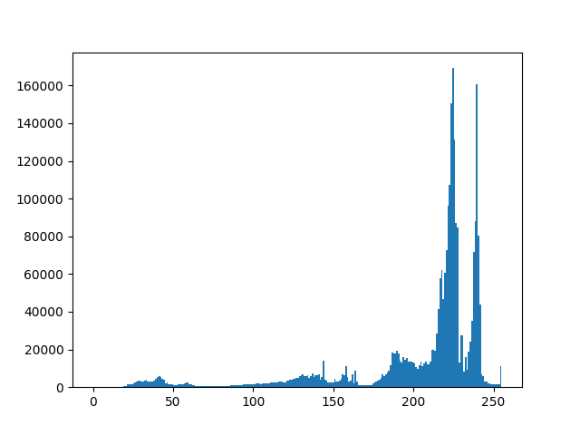

### 加噪后图像
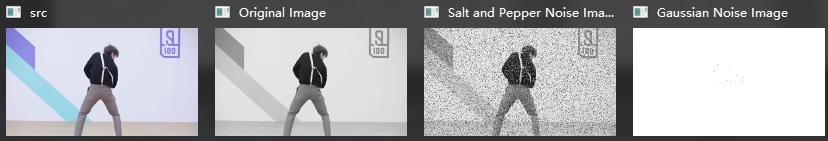 

信噪比：

Salt and Pepper Noise SNR: -4.523844850213193   
Gaussian Noise SNR: -0.20829607631779096

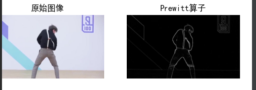

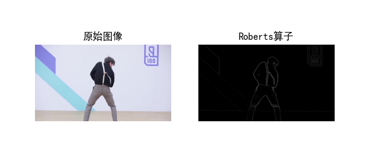
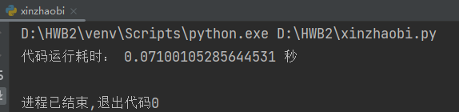
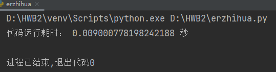
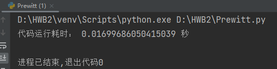
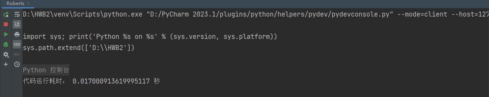

canny算子对添加椒盐噪声的图像上进行边缘检测（可能有错误）
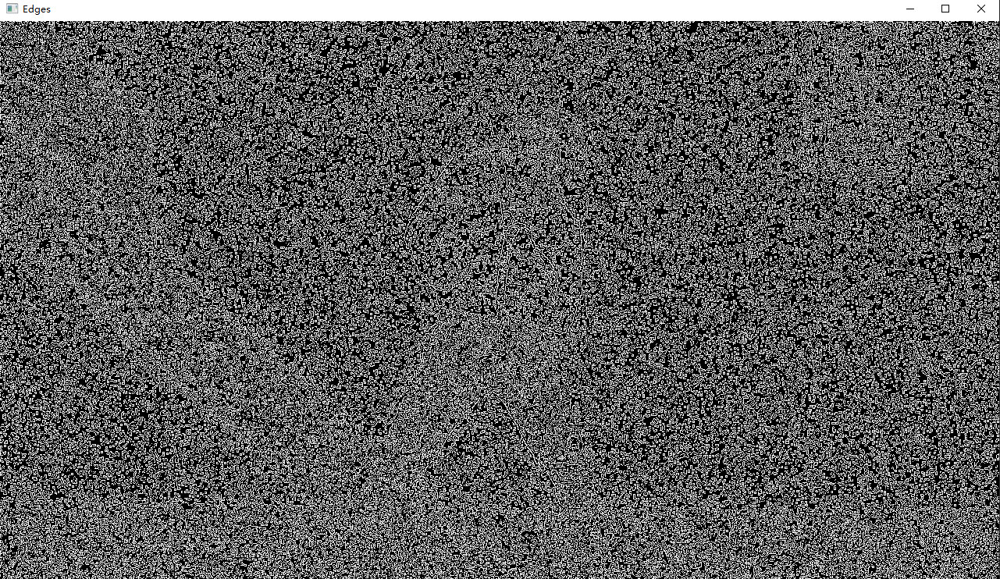
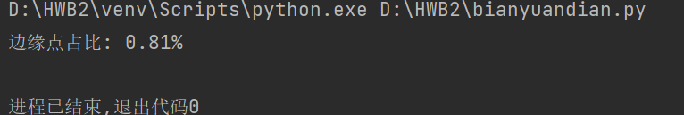
##### 总结：这次选的图片不是经典图像处理案例，在学习的初步过程中还是需要先模仿并对自己处理的结果进行验证，重复的代码太多，没有形成模块化结构，以后需要改进。
#### 不足：1、未完成通过算子对加载高斯噪声的图像进行边缘检测。2、二值化处理直接对原图进行了操作，没有对加噪后的图像进行处理。

